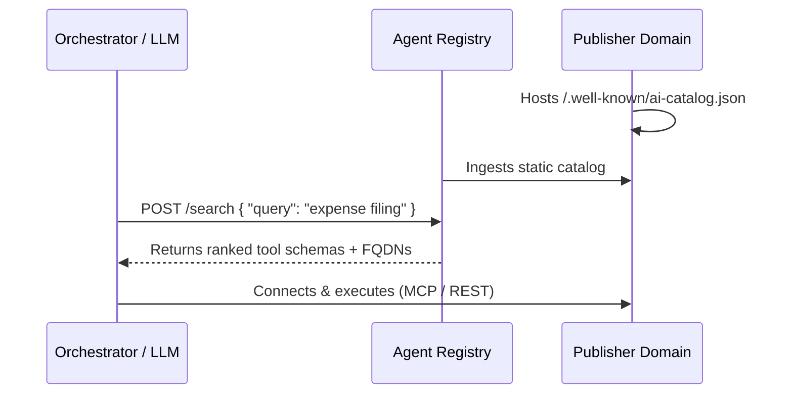

# Overview & Architecture

> Organizing agents, tools, and skills isn't really all that difficult, until you need to do so globally and with cryptographic trust guarantees.

Agent Finder is a lightweight, domain-anchored discovery specification. It defines how AI capabilities (MCP servers, A2A cards, skills, and traditional API tools) are cataloged, searched, and dynamically discovered across federated networks.

---

## 1. The Scaling Problem (Prompt Bloat)

Feeding every available tool schema directly into a system prompt works fine when you have five tools. When you have five thousand, your context window vanishes, latency spikes, and the LLM's selection accuracy drops.

```
❌ Walled Garden / Prompt-Stuffing:
[System Prompt] + [User Query] + [Tool A] + [Tool B] + [Tool C]... = Prompt Bloat

✅ Search-First (Agent Finder):
[User Query] ──> [Registry API (POST /search)] ──> [Top 3 Tools] ──> [LLM Context]
```

Instead of forcing the LLM to sort through the noise, Agent Finder moves selection outside the active context window. The orchestrator queries a dedicated semantic search index first, injecting only the top matching schemas into the final prompt.

---

## 2. How it Differs from the "App Store" Model

We are moving away from manually installed, hardcoded integrations toward dynamic runtime discovery.

| Vector | Centralized Registries (e.g., MCP Registry) | Federated Search (Agent Finder) |
| :--- | :--- | :--- |
| **Discovery** | Manual registration / gatekeeper approval | Dynamic crawling and indexing (SEO for agents) |
| **Hosting** | Single central repository database | Self-hosted on publisher domains |
| **Lifecycle** | Hardcoded configs and manual installs | Discovered and connected at runtime |
| **Scope** | Restricted to a single protocol (e.g., MCP only) | Protocol-agnostic envelope (MCP, A2A, Skills) |

---

## 3. Decentralized Trust (No Central Kingmakers)

Centralized directories create administrative bottlenecks and unilateral gatekeepers. Agent Finder avoids this by anchoring logical names directly to DNS domains:

```text
urn:ai:acme.com:finance:trading
```

*   **Domain Authority**: Because the namespace maps to a FQDN (`acme.com`), the publisher domain acts as the cryptographic trust root.
*   **Workload Identity**: The domain binds directly to the host's cryptographic identity (like SPIFFE or `did:web`) in a local `trustManifest`.
*   **No Walled Gardens**: Anyone can index these URNs, verify their provenance, and offer custom search engines without requiring a central naming committee.

---

## 4. The Core Mechanics

Agent Finder operates on a simple envelope design using standard and proposed **IANA Media Types** (like `application/mcp-server+json` or `application/a2a-agent-card+json`) to wrapper different protocols, delegating execution details to the underlying schemas.



1.  **Publish**: You host an `ai-catalog.json` at your domain's `.well-known/` directory.
2.  **Index**: Crawlers index your manifest and generate vector embeddings from your `representativeQueries`.
3.  **Search**: Clients query a registry (`POST /search`) with natural language.
4.  **Execute**: The client gets back the exact tool schema and endpoint URL, connecting dynamically.
